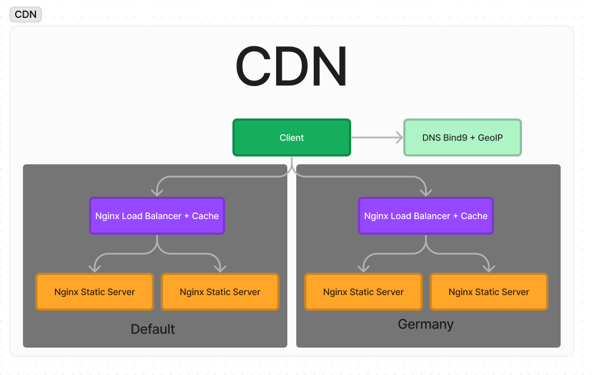
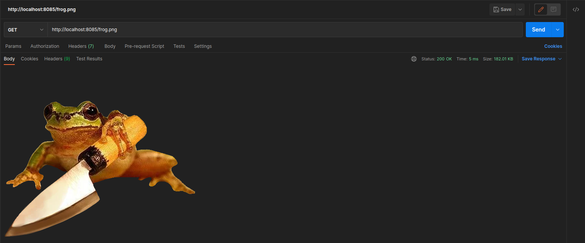
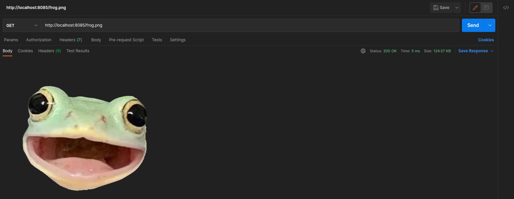

# Selfmade CDN

To start application run the simple command:

```bash
docker-compose up -d
```

It will run the applications:

  * [GeoDNS Server](http://localhost:8084/) on ports `127.0.0.1:53/tcp,127.0.0.1:53/udp,127.0.0.1:953/tcp`
  * [Nginx default load balancer](http://localhost:8083/) on port `8083`
  * [Nginx load balancer for germany](http://localhost:8084/) on port `8084`
  * [Nginx for DNS test](http://localhost:8085/) on port `8085`

## API Usage

  By default you in a Germany network scope. If you want to switch for example to Ukraine you need to replace `20.79.0` string to `94.153.0` in all of the project files.

* Open link in a browser to get a image from CDN [http://localhost:8085/frog.png](http://localhost:8085/frog.png)

## CDN Infrastructure



## CDN is working.

  * Ukrainian IP
    

  * Germany IP
    

## Balancing approaches

  * Round Robin
      
      pros: Lower memory and CPU footprint from the Load Balancer.

      cons: Not adaptive, sends traffic to nodes without regard for distribution.

  * Least Connections

    pros: Adaptive, provided even distribution of workload among nodes.

    cons: Requires larger memory and CPU footprint for connection tracking.

  * Least Time

    pros: Adaptive, low memory, and CPU requirement.

    cons: Limited workload distribution, connections and workload often fills up one node at a time.

  * Random

    pros: Requires a low memory and CPU footprint from load balancer device.

    cons: Niche, only useful in specific scenarios. Unreliable distribution of workload.

  * IP Hash

    pros: Session persistence, cache coherence, predictable behavior, sticky sessions.

    cons: Uneven distribution, scaling challenges, sensitive to changes in traffic patterns, session complexity, limited flexibility.